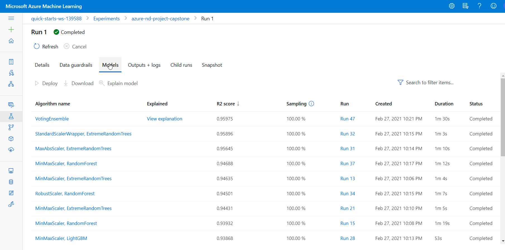
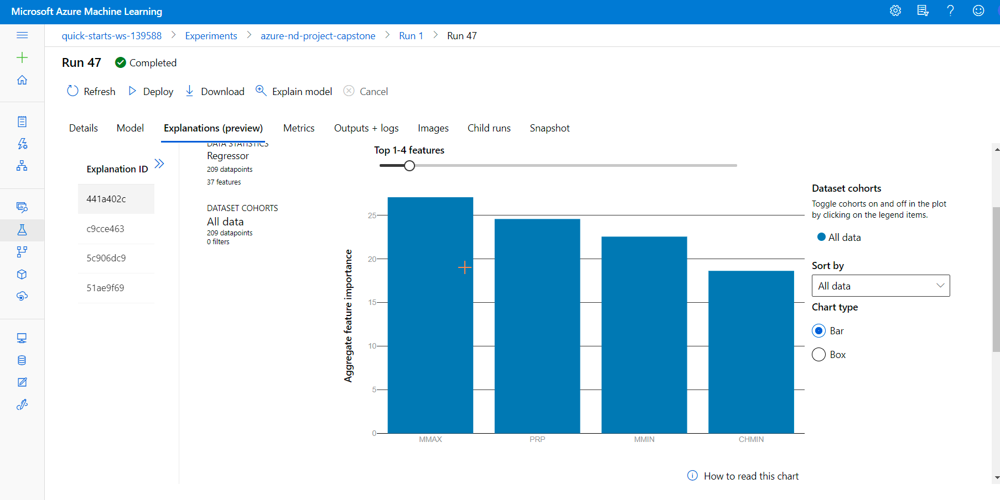
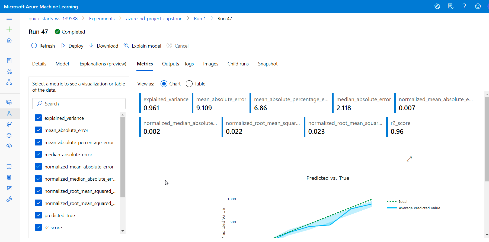
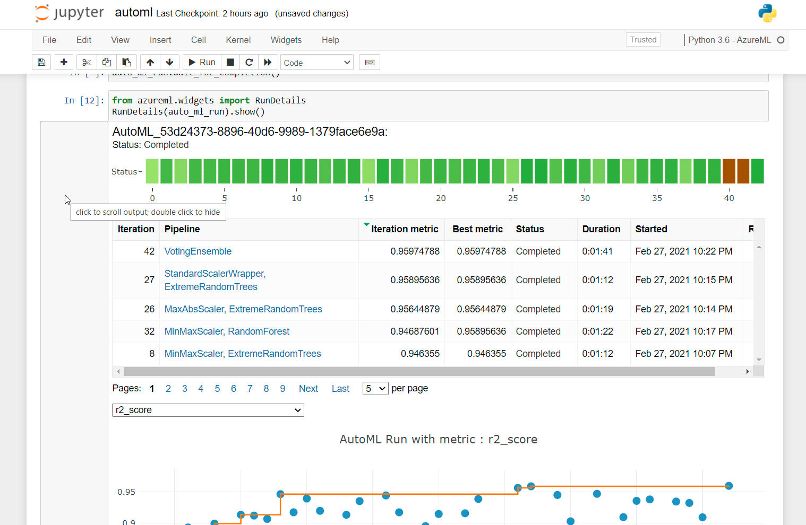
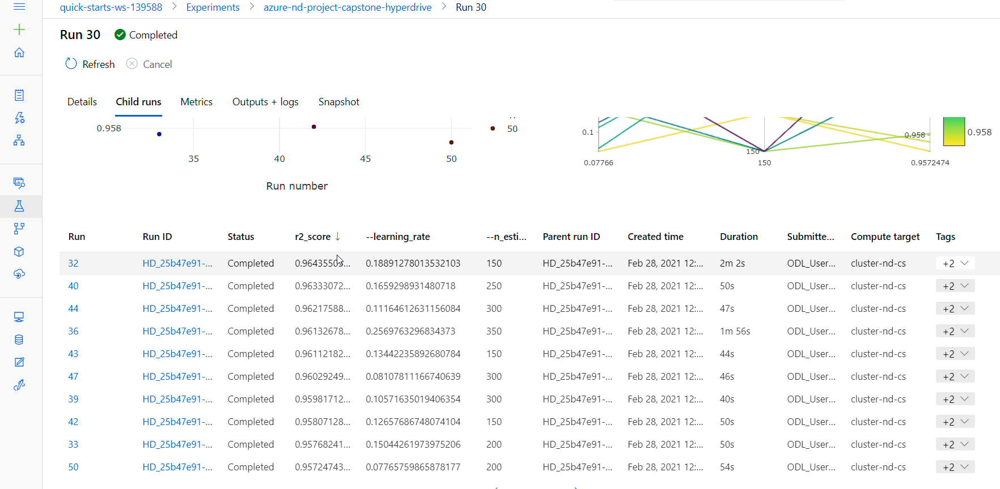
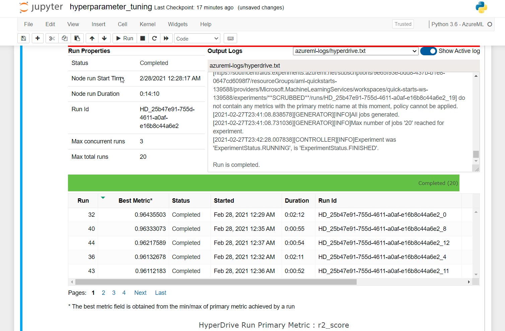
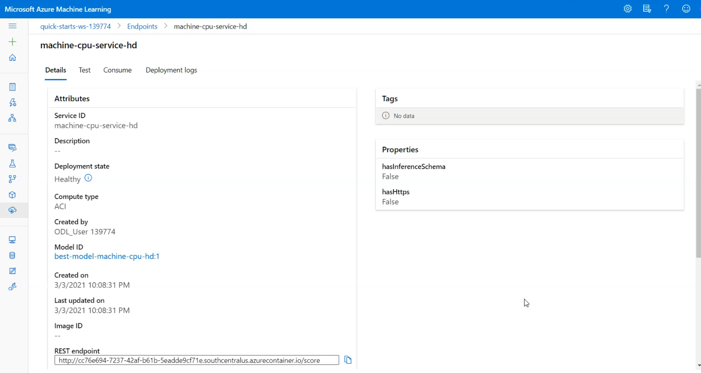

- [Predicting the CPU relative performance](#predicting-the-cpu-relative-performance)
  - [Dataset](#dataset)
    - [Overview](#overview)
    - [Task](#task)
    - [Access](#access)
    - [Preparation](#preparation)
      - [Features](#features)
    - [Data transformation and registration](#data-transformation-and-registration)
  - [Automated ML](#automated-ml)
    - [Results](#results)
    - [Possible improvements](#possible-improvements)
  - [Hyperparameter Tuning](#hyperparameter-tuning)
    - [Results](#results-1)
    - [Possible improvements](#possible-improvements-1)
  - [Model Deployment](#model-deployment)
    - [Querying the endpoint](#querying-the-endpoint)
  - [Screen Recording](#screen-recording)
- [Resources](#resources)

# Predicting the CPU relative performance

## Dataset

### Overview
The [CPU performance](https://archive.ics.uci.edu/ml/machine-learning-databases/cpu-performance/) dataset is taken from the UCI Machine Learning Repository.

### Task
The task is to predict the CPU relative performance of computer processors. The relative performance is represented by the *ERP* feature in the dataset.

### Access
The zipped dataset in [csv](;/../data/machine.zip) format is uploaded to Azure ML workspace.
After the data is cleansed, the resulting dataset is registered in the Workspace for further use.

### Preparation

#### Features
Here is a list of dataset features:
   1. Vendor name - nominal, categorical: adviser, amdahl,apollo, basf, bti, burroughs, c.r.d, cambex, cdc, dec, 
       dg, formation, four-phase, gould, honeywell, hp, ibm, ipl, magnuson, microdata, nas, ncr, nixdorf, perkin-elmer, prime, siemens, sperry, sratus, wang
   1. Model Name - string,  many unique symbols
   2. MYCT - integer, machine cycle time in nanoseconds
   3. MMIN - integer, minimum main memory in kilobytes
   4. MMAX - integer,  maximum main memory in kilobytes
   5. CACH - integer,  cache memory in kilobytes
   6. CHMIN - integer,  minimum channels in units
   7. CHMAX - integer,  maximum channels in units
   8. PRP - integer,  published relative performance 
   9. *ERP* - integer,  estimated relative performance (the value to predict)

### Data transformation and registration

I perform the same data transformation for the AutoMl run and for the HyperDrive run to have the most comparable results.

The [cleansing script](./scripts/cleansing.py) uses pandas to transform features:
* categorical features transformation: hot encoding
* column drop
  
The resulting dataset is registered in the ML workspace. 
```py
from scripts.cleansing import clean_data
import pandas as pd

def get_cleaned_dataset(ws):
    found = False
    ds_key = "machine-cpu"
    description_text = "CPU performance dataset (UCI)."

    if ds_key in ws.datasets.keys(): 
        found = True
        ds_cleaned = ws.datasets[ds_key] 

    # Otherwise, create it from the file
    if not found:

        with zipfile.ZipFile("./data/machine.zip","r") as zip_ref:
            zip_ref.extractall("data")

        #Reading a json lines file into a DataFrame
        data = pd.read_csv('./data/machine.csv')
        # DataFrame with cleaned data
        cleaned_data = clean_data(data)
        exported_df = 'cleaned-machine-cpu.parquet'
        cleaned_data.to_parquet(exported_df)
        # Register Dataset in Workspace using experimental funcionality to upload and register pandas dataframe at once
        ds_cleaned = TabularDatasetFactory.register_pandas_dataframe(dataframe=cleaned_data,
                                                                     target=(ws.get_default_datastore(), exported_df),
                                                                     name=ds_key, description=description_text,
                                                                     show_progress=True)
    return ds_cleaned
```

## Automated ML
Predicting a CPU relative performance value is a [Regression](https://en.wikipedia.org/wiki/Linear_regression) task.

According to Azure [documentation](https://docs.microsoft.com/en-us/azure/machine-learning/how-to-configure-auto-train#primary-metrics-for-regression-scenarios):
> Metrics like `r2_score`  and `spearman_correlation` can better represent the quality of model when the scale of the value-to-predict covers many orders of magnitude.

The 'ERP' minimum value is 15, maximum value is 1238. So th scale is not exactly the same.

I'll be using `r2_score` metric. It is supported by AutoML and by [GradientBoostingRegressor](https://scikit-learn.org/stable/modules/ensemble.html#regression) which I use for HyperDrive run. 

The resulting configuration looks like this:
```py
from azureml.train.automl import AutoMLConfig
auto_ml_directory_name = 'auto_ml_run'

auto_ml_directory = create_folder(project_folder, auto_ml_directory_name)

automl_settings = {
    "experiment_timeout_minutes": 40, #15 minutes is the minimum
    "enable_early_stopping": True,
    "primary_metric": 'r2_score', # the same as hyperdrive
    "featurization": 'auto',
    "verbosity": logging.DEBUG,
    "n_cross_validations": 10
}

automl_config = AutoMLConfig(compute_target=compute_target,
                             max_concurrent_iterations=3, #4 nodes
                             task= "regression",
                             training_data=dataset,
                             label_column_name="ERP",
                             debug_log = "automl_errors.log",
                             path = auto_ml_directory,
                             enable_onnx_compatible_models=True,
                             **automl_settings
                            )
```

### Results
The best model, compatible with ONNX format, with`r2_score=0.9597` is VotingEnsemble according to the results available in the Azure ML Studio:


The best model explanation and metrics can be also found in Azure Ml Studio:



The parameters of the best run can be extracted using a helper function provided in an [Azure tutorial](https://docs.microsoft.com/en-us/azure/machine-learning/how-to-configure-auto-features#scaling-and-normalization):
```py
from pprint import pprint

# Helper function copied from Azure tutorial 
# https://docs.microsoft.com/en-us/azure/machine-learning/how-to-configure-auto-features#scaling-and-normalization
def print_model(model, prefix=""):
    for step in model.steps:
        print(prefix + step[0])
        if hasattr(step[1], 'estimators') and hasattr(step[1], 'weights'):
            pprint({'estimators': list(
                e[0] for e in step[1].estimators), 'weights': step[1].weights})
            print()
            for estimator in step[1].estimators:
                print_model(estimator[1], estimator[0] + ' - ')
        else:
            pprint(step[1].get_params())
            print()
``` 

And here is the result:
```
Model step details:

datatransformer
{'enable_dnn': None,
 'enable_feature_sweeping': None,
 'feature_sweeping_config': None,
 'feature_sweeping_timeout': None,
 'featurization_config': None,
 'force_text_dnn': None,
 'is_cross_validation': None,
 'is_onnx_compatible': None,
 'logger': None,
 'observer': None,
 'task': None,
 'working_dir': None}

prefittedsoftvotingregressor
{'estimators': [('33',
                 Pipeline(memory=None,
         steps=[('minmaxscaler', MinMaxScaler(copy=True, feature_range=(0, 1))),
                ('extratreesregressor',
                 ExtraTreesRegressor(bootstrap=False, ccp_alpha=0.0,
                                     criterion='mse', max_depth=None,
                                     max_features=0.5, max_leaf_nodes=None,
                                     max_samples=None,
                                     min_impurity_decrease=0.0,
                                     min_impurity_split=None,
                                     min_samples_leaf=0.0023646822772690063,
                                     min_samples_split=0.005285388593079247,
                                     min_weight_fraction_leaf=0.0,
                                     n_estimators=100, n_jobs=1,
                                     oob_score=False, random_state=None,
                                     verbose=0, warm_start=False))],
         verbose=False)),
                ('27',
                 Pipeline(memory=None,
         steps=[('maxabsscaler', MaxAbsScaler(copy=True)),
                ('extratreesregressor',
                 ExtraTreesRegressor(bootstrap=False, ccp_alpha=0.0,
                                     criterion='mse', max_depth=None,
                                     max_features=0.4, max_leaf_nodes=None,
                                     max_samples=None,
                                     min_impurity_decrease=0.0,
                                     min_impurity_split=None,
                                     min_samples_leaf=0.003466237459044996,
                                     min_samples_split=0.000630957344480193,
                                     min_weight_fraction_leaf=0.0,
                                     n_estimators=400, n_jobs=1,
                                     oob_score=False, random_state=None,
                                     verbose=0, warm_start=False))],
         verbose=False)),
                ('45',
                 Pipeline(memory=None,
         steps=[('standardscalerwrapper',
                 <azureml.automl.runtime.shared.model_wrappers.StandardScalerWrapper object at 0x7f0431282ba8>),
                ('extratreesregressor',
                 ExtraTreesRegressor(bootstrap=False, ccp_alpha=0.0,
                                     criterion='mse', max_depth=None,
                                     max_features=0.6, max_leaf_nodes=None,
                                     max_samples=None,
                                     min_impurity_decrease=0.0,
                                     min_impurity_split=None,
                                     min_samples_leaf=0.004196633747563344,
                                     min_samples_split=0.002602463309528381,
                                     min_weight_fraction_leaf=0.0,
                                     n_estimators=600, n_jobs=1,
                                     oob_score=False, random_state=None,
                                     verbose=0, warm_start=False))],
         verbose=False)),
                ('14',
                 Pipeline(memory=None,
         steps=[('minmaxscaler', MinMaxScaler(copy=True, feature_range=(0, 1))),
                ('extratreesregressor',
                 ExtraTreesRegressor(bootstrap=False, ccp_alpha=0.0,
                                     criterion='mse', max_depth=None,
                                     max_features=None, max_leaf_nodes=None,
                                     max_samples=None,
                                     min_impurity_decrease=0.0,
                                     min_impurity_split=None,
                                     min_samples_leaf=0.001953125,
                                     min_samples_split=0.0010734188827013528,
                                     min_weight_fraction_leaf=0.0,
                                     n_estimators=10, n_jobs=1, oob_score=False,
                                     random_state=None, verbose=0,
                                     warm_start=False))],
         verbose=False)),
                ('8',
                 Pipeline(memory=None,
         steps=[('minmaxscaler', MinMaxScaler(copy=True, feature_range=(0, 1))),
                ('extratreesregressor',
                 ExtraTreesRegressor(bootstrap=False, ccp_alpha=0.0,
                                     criterion='mse', max_depth=None,
                                     max_features=None, max_leaf_nodes=None,
                                     max_samples=None,
                                     min_impurity_decrease=0.0,
                                     min_impurity_split=None,
                                     min_samples_leaf=0.0028629618034842247,
                                     min_samples_split=0.005285388593079247,
                                     min_weight_fraction_leaf=0.0,
                                     n_estimators=100, n_jobs=1,
                                     oob_score=False, random_state=None,
                                     verbose=0, warm_start=False))],
         verbose=False)),
                ('9',
                 Pipeline(memory=None,
         steps=[('standardscalerwrapper',
                 <azureml.automl.runtime.shared.model_wrappers.StandardScalerWrapper object at 0x7f0431086f60>),
                ('elasticnet',
                 ElasticNet(alpha=0.05357894736842105, copy_X=True,
                            fit_intercept=True, l1_ratio=0.6873684210526316,
                            max_iter=1000, normalize=False, positive=False,
                            precompute=False, random_state=None,
                            selection='cyclic', tol=0.0001,
                            warm_start=False))],
         verbose=False))],
 'weights': [0.4,
             0.06666666666666667,
             0.06666666666666667,
             0.26666666666666666,
             0.06666666666666667,
             0.13333333333333333]}
```


We can also monitor the results of the run within `RunDetails` widget in the notebook:


### Possible improvements

The column 'Model Name' was dropped from the dataset, since it contains random text. The improvement could be splitting this column into 2: 'model name' and 'model subname' since it has the format : "name"/"subname". The new column "model name" is a nominal feature (which has hight carinality). It could be encoded using hashing, for example with SKLearn[FeatureHasher](https://scikit-learn.org/stable/modules/generated/sklearn.feature_extraction.FeatureHasher.html). The "nodel subname" however stays too random to be taken into consideration, so it could be dropped.

Many machine learning algorithms perform better when dataset features are on a relatively similar scale and/or close to normally distributed. Linear regression takes part of these algorithms. We can see that input features do not have the same scale, so numeric features could be normalized by using one of the available  normalization SKLearn algorithms, for example [MinMaxScaler](https://scikit-learn.org/stable/modules/generated/sklearn.preprocessing.MinMaxScaler.html). 

Another improvement for the AutoML tun could be fixing the allowed list of algorithms to use, with the help of [allowed_models](https://docs.microsoft.com/en-us/python/api/azureml-train-automl-client/azureml.train.automl.automlconfig.automlconfig?view=azure-ml-py) parameter.  For example we can see that `ElasticNet`, `XGBoostRegressor`, `LassoLars`, `GradientBoosting` perform well on the data, so we could put it in the `allowed_models` list.

## Hyperparameter Tuning

For hyperparameter tuning I've chosen the [Gradient Boosting regression](https://scikit-learn.org/stable/auto_examples/ensemble/plot_gradient_boosting_regression.html) algorithm with a [Huber loss function](https://scikit-learn.org/stable/modules/ensemble.html#gradient-boosting-loss). Gradient Boosting performs well for a regression task.

I will tune 2 major hyperparameters of the GradientBoosting, which strongly  interact with each other:
* n_estimators - the number of weak learners (i.e. regression trees); the number of boosting stages to perform
* learning_rate - a value in the range (0.0, 1.0] that controls overfitting via [shrinkage](https://scikit-learn.org/stable/modules/ensemble.html#gradient-boosting-shrinkage) (the coefficient of contribution of each weak learner)


The [hyperdrive-run](./hyperdrive-run.ipynb) notebook sets up the [HyperDrive run](https://docs.microsoft.com/en-us/python/api/azureml-train-core/azureml.train.hyperdrive.hyperdriverun?view=azure-ml-py).
I use [random hypermarameters sampling](https://docs.microsoft.com/en-us/azure/machine-learning/how-to-tune-hyperparameters#random-sampling) configuration, which is less time-consuming than GridParameterSampling and gives good results.
```py
ps = RandomParameterSampling(
    {
        '--learning_rate': uniform(0.01, 0.3),# Contribution of each tree: uniform discribution 
        '--n_estimators': choice(100, 150, 200, 250, 300, 350), # Number of learners
    }
)
```
I use `uniform` distribution for learning rate between 0.01 and 0.3, since smaller values give better results, coupled with high values of the number of learners. The number of learners (a.k.a n_estimators) is a `choice` option among the list of provided values. 

For early stopping policy I chose [BanditPolicy](https://docs.microsoft.com/en-us/python/api/azureml-train-core/azureml.train.hyperdrive.banditpolicy?view=azure-ml-py) which compares the performance of the current run (after the specified number of intervals) with the "best current score", and if the measured performance is smaller (by the slack factor), the policy cancels the run.
```py
policy = BanditPolicy(slack_factor=0.01, delay_evaluation = 50)
```
To avoid avoid premature termination of training runs, I use `delay_evaluation` of 50.

The primary metric is the same as for AutoML run: `r2_score` which we need to maximaze, since the closer `r2_score` is to 1, the better the model performs.

### Results
We can see that we've obtained the best result with `n_estimators=150` and `learning_rate=0,1889` with the `r2_score=0,964356`.
This model slightly outperforms AutoML model, which has `r2_score=0,95975`.

HyperDrive run models:


### Possible improvements
Possible improvements:
* normalizing the numeric features before training using [MinMaxScaler](https://scikit-learn.org/stable/modules/generated/sklearn.preprocessing.MinMaxScaler.html) to the range of 0 to 1.
* standardizing numeric features whose distribution is close to normal using [StandardScaler](https://scikit-learn.org/stable/modules/generated/sklearn.preprocessing.StandardScaler.html#sklearn.preprocessing.StandardScaler)
* perform another HyperDrive run with [GridParameterSampling](https://docs.microsoft.com/en-us/python/api/azureml-train-core/azureml.train.hyperdrive.gridparametersampling?view=azure-ml-py) with the smaller range of the parameters' values to tune the values even further. For example `n_estimators` between 150 and 200 with the step of 10 (choice) and learning_rate between 0,18 and 0,15 with the step of 0,01 (choice).

We can monitor the results of the run within `RunDetails` widget in the notebook:


## Model Deployment

The best performing model is the model produced by the HyperDrive run. So I will be deploying the sklearn model.
For deployment we should use exactly the same environment as for training. I my case I used "AzureML-AutoML" curated environment.
The [scoring script](./scripts/score.py) loads the model from the workspace registry by its name and passes the received payload into `predict()` function.

The resulting inference configuration:
```py
from azureml.core import Environment
from azureml.core.model import InferenceConfig

env = Environment.get(workspace=ws, name="AzureML-AutoML")

inference_config = InferenceConfig(entry_script='./scripts/score.py',
                                   environment=env)
```

Deployment configuration with authentication enabled:
```py
from azureml.core.webservice import Webservice, AciWebservice
from azureml.core.model import Model

print("Prepare ACI deployment configuration")
# Enable application insights
config = AciWebservice.deploy_configuration(cpu_cores = 1, 
                                            memory_gb = 1,
                                            enable_app_insights=True,
                                            auth_enabled=True)
```

And the model can be deployed via Model class:
```py
from azureml.core.model import Model

try: model_hd
except NameError:
    model_hd = Model(ws, 'best-model-machine-cpu-hd')

# deploying to ACI using curated environment and the generated  scoring script
service_name_hd = 'machine-cpu-service-hd'
service_hd = Model.deploy(workspace=ws, name = service_name_hd, models=[model_hd],
                       overwrite=True, deployment_config=config, inference_config=inference_config)


service_hd.wait_for_deployment(show_output = True)
```

### Querying the endpoint

Now that the model is deployed and it's status is "Healthy", we can get the endpoint URI either in the Machine Learning Studio or via SDK using `scoring_uri` property of the service.
Deployed model details in ML Studio:


For HTTP request to be authenticated, I add `Authorization` header with the service's authentication key value:
```py
headers = {'Content-Type': 'application/json', 'Accept': 'application/json'}

if service_hd.auth_enabled:
    headers['Authorization'] = 'Bearer '+ service_hd.get_keys()[0]
```

The input for the service is in [JSON](.org/json-en.html) format. The data item was transformed the same way as for training. See [cleansing.py](scripts/cleansing.py) for more details.

Sending POST request to the scoring URI:
```py
scoring_uri = service_hd.scoring_uri

input_payload = json.dumps({
    "data":
         [{"MYCT": 29,"MMIN": 8000,"MMAX": 32000,"CACH": 32,"CHMIN": 8,"CHMAX": 32,"PRP": 208,"vendor_adviser": 0,
           "vendor_amdahl": 1,"vendor_apollo": 0,"vendor_basf": 0,"vendor_bti": 0,"vendor_burroughs": 0,
           "vendor_c.r.d": 0,"vendor_cambex": 0,"vendor_cdc": 0,"vendor_dec": 0,"vendor_dg": 0,"vendor_formation": 0,
           "vendor_four-phase": 0,"vendor_gould": 0,"vendor_harris": 0,"vendor_honeywell": 0,"vendor_hp": 0,"vendor_ibm": 0,
           "vendor_ipl": 0,"vendor_magnuson": 0,"vendor_microdata": 0,"vendor_nas": 0,"vendor_ncr": 0,"vendor_nixdorf": 0,
           "vendor_perkin-elmer": 0,"vendor_prime": 0,"vendor_siemens": 0,"vendor_sperry": 0,"vendor_sratus": 0,        
           "vendor_wang": 0}],
    'method': 'predict' 
})

response = requests.post(
        scoring_uri, data=input_payload, headers=headers)
print(response.status_code)
print(response.elapsed)
print(response.json())
```

## Screen Recording

The [screencast](https://youtu.be/K5BRaXXhdV4) demonstrates:
- A working model
- Demo of the deployed  model
- Demo of a sample request sent to the endpoint and its response

# Resources

* [Tutorial: Use automated machine learning to predict taxi fares](https://docs.microsoft.com/en-us/azure/machine-learning/tutorial-auto-train-models)
* https://towardsdatascience.com/scale-standardize-or-normalize-with-scikit-learn-6ccc7d176a02